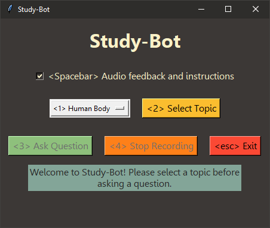

# Study-Bot

**Study-Bot** is an open-source project developed by **Edumakers** from **Tecnológico de Monterrey**. It is designed to help visually impaired students review their academic course material. It is an AI-powered study companion that incorporates various technologies, including [Whisper](https://openai.com/research/whisper), [GPT-3.5-turbo-16k](https://platform.openai.com/docs/models/gpt-3-5), [Elevenlabs text-to-speech](https://github.com/elevenlabs/elevenlabs-python), and [OpenCV](https://opencv.org/). For testing purposes, sample course material was generated using [ChatGPT](https://openai.com/blog/chatgpt).

<dl><dd><dl><dd>

</dd></dl></dd></dl>

**Study-Bot** can: listen to the user's question, analyze the source material of the topic they want to study, detect the physical educational material that they are holding by its color or ArUco marker, generate an answer, and read it out loud to the user as an accessible executable application. For development and testing purposes, it can be run through the **Python** interpreter as a **CLI** program or with a **GUI**.


Some good next steps could be to embed this system into a more advanced user interface for distribution as a desktop application, create a computer vision model that can detect the physical educational material without depending on color or ArUco markers, as well as some performance improvements and new interactive features.

## Contributors

- Aarón Francisco Urbina de la Cruz ( [@Prodygyt](https://github.com/Prodygyt) )
- Abiel Adrián Lozano Herrejón ( [@abiel-lozano](https://github.com/abiel-lozano) )

## Installation and Usage

It is recomended to use [Python 3.9.9](https://www.python.org/downloads/release/python-399/) so that the `whisper` library can be used without issues. To avoid having to remove your current **Python** installation, you may want to use a virtual enviroment to use this specific version of **Python**. To install the required dependencies, run the following command:

```bash
pip install -r requirements.txt
```
There are some additional steps that need to be taken before being able to run the project, such as the aquisition of your own API keys for the AI services used here. For more information, please refer to the `Documentation` folder for a comprehensive guide on how to use this project.

## What We Used

**Study-Bot** relies on the following existing services and technologies:


- **[Whisper:](https://openai.com/research/whisper)** Used for speech-to-text conversion, allowing users to speak their questions to be fed into the GPT model.

- **[gpt-3.5-turbo-16k:](https://platform.openai.com/docs/models/gpt-3-5)** Used for question processing and answer generation. The 16k version of the model was chosen for its 16,385-token context window size, which is needed to process a large amount of source material.

- **[Elevenlabs text-to-speech:](https://beta.elevenlabs.io/)** Used for text-to-speech conversion, allowing users to hear the answers generated by the GPT model.

- **[OpenCV:](https://opencv.org/)** Used for physical object identification, to aid the GPT-3.5-16k model in answering questions with the added context of what the user is holding.

## Contributing and Codebase Usage

You may use this project as reference for your own projects, or fork it to make your own contributions, and other uses. GitHub issues regarding feature requests and bug reports are welcome and are specially valued if it includes feedback from visually impaired users.
